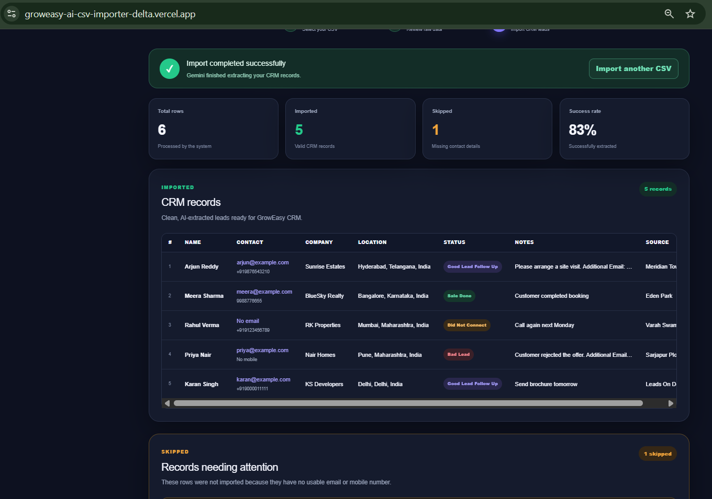
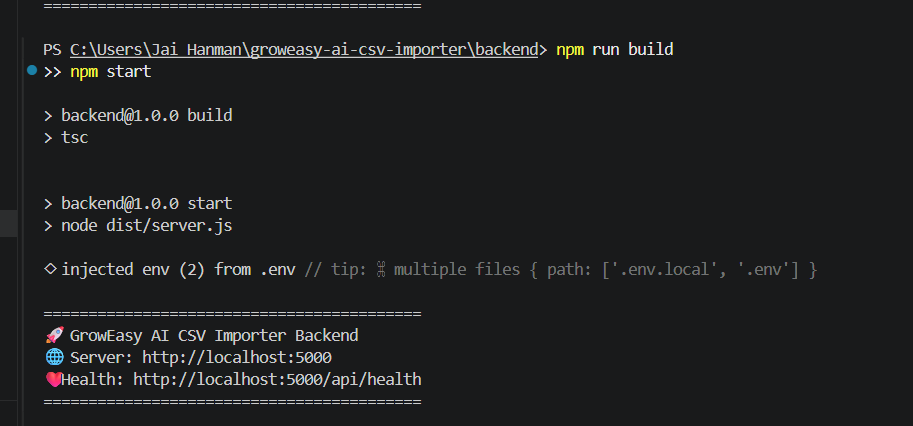
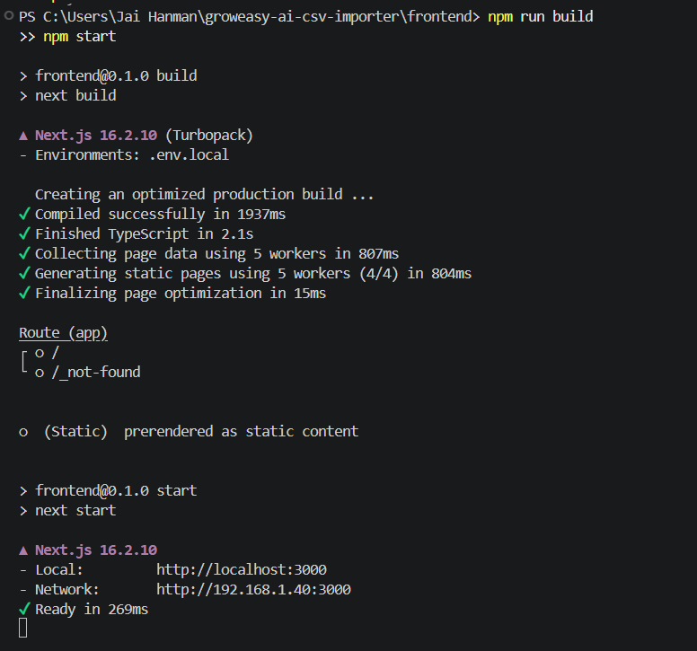
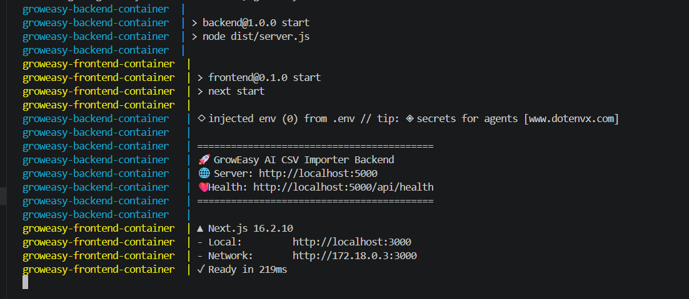
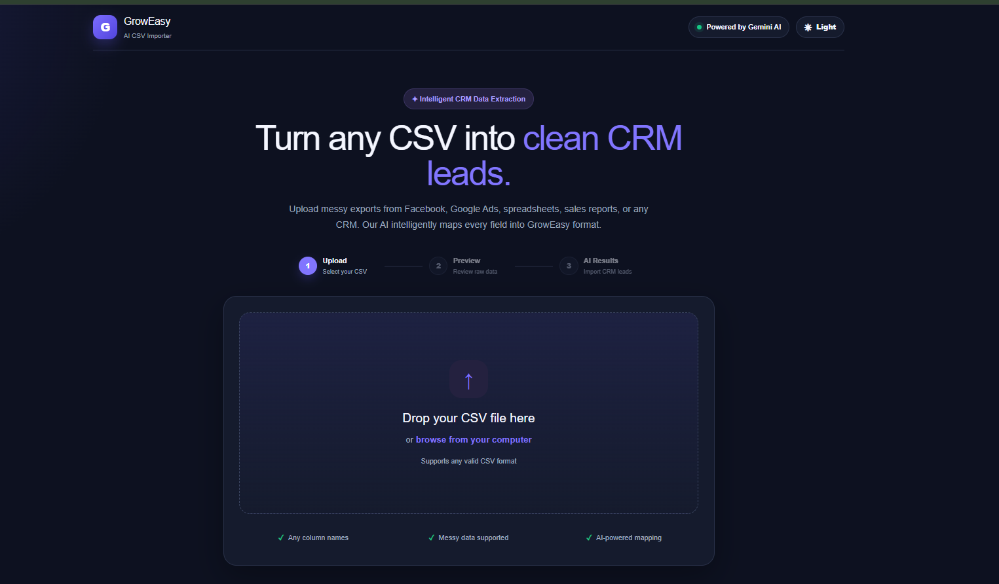
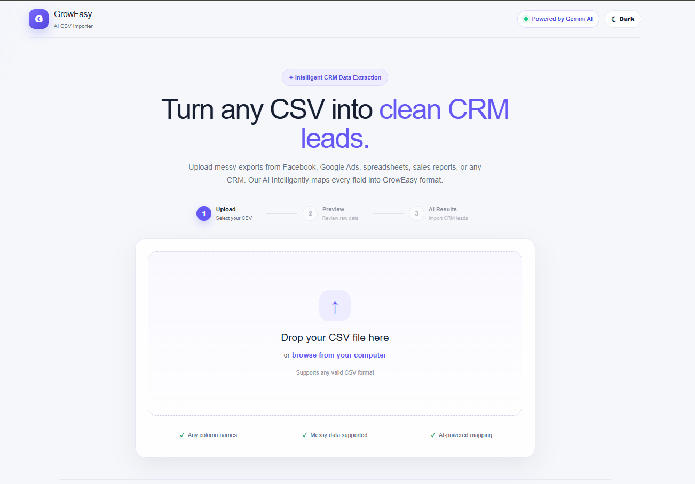
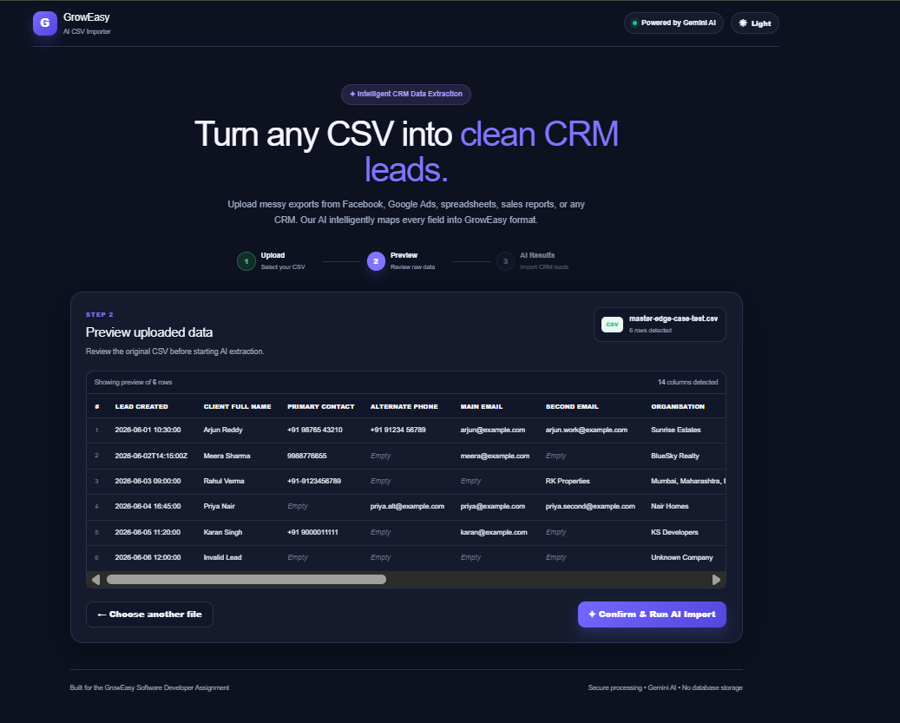
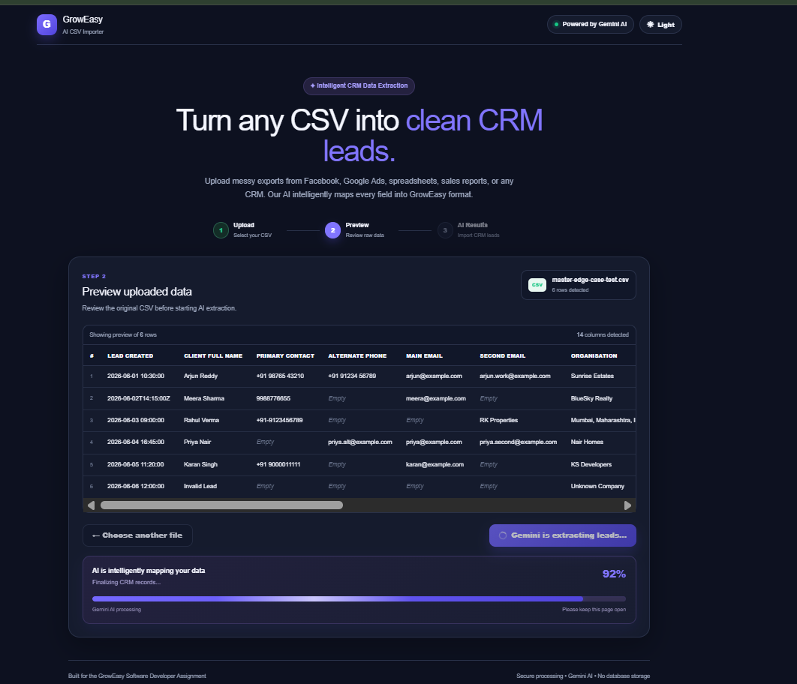
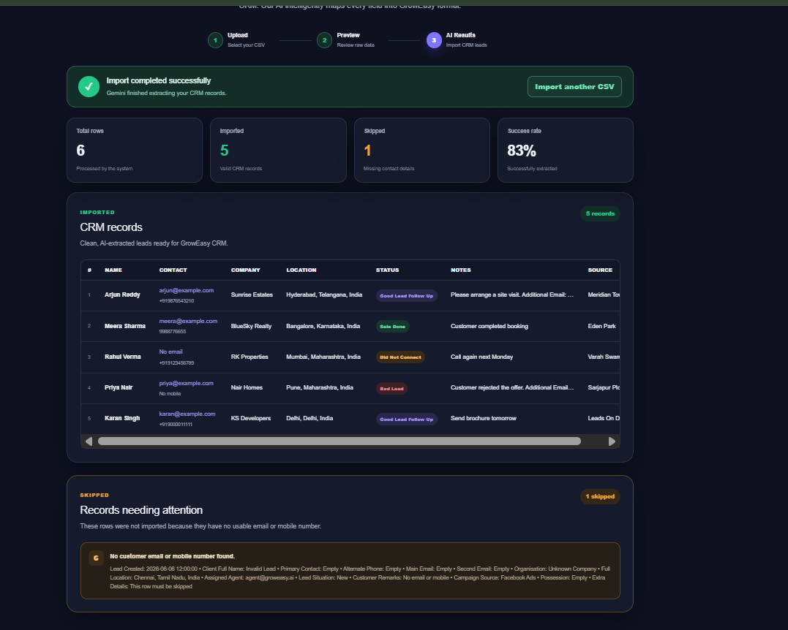

# GrowEasy AI-Powered CSV Importer

An AI-powered CSV importer that converts messy and inconsistent CSV
exports into clean, structured GrowEasy CRM lead records.

The application accepts CSV files with arbitrary column names and
layouts, previews the raw data before processing, and uses Gemini AI to
intelligently map each row into the required CRM format.

## Live Application

  ---------------------------------------------------------------------------------------------------
  Service                             URL
  ----------------------------------- ---------------------------------------------------------------
  Live Frontend                       https://groweasy-ai-csv-importer-delta.vercel.app

  Live Backend                        https://groweasy-ai-csv-importer-vscm.onrender.com

  Backend Health Check                https://groweasy-ai-csv-importer-vscm.onrender.com/api/health

  GitHub Repository                   https://github.com/Disney35/groweasy-ai-csv-importer
  ---------------------------------------------------------------------------------------------------

> The backend is hosted on Render's free tier. The first request may
> take longer if the service has been inactive and needs to wake up.

## Application Screenshots

### Production AI Results

The complete deployed workflow has been successfully tested end to end.



### Backend Production Build



### Frontend Production Build



### Docker Compose



### Upload CSV --- Dark Mode



### Upload CSV --- Light Mode



### CSV Preview



### Gemini AI Processing



### Import Results



## Features

### Core Features

-   Upload any valid CSV file
-   Drag-and-drop and file picker support
-   Parse CSV files without assuming fixed column names
-   Preview raw CSV data before AI processing
-   Responsive tables with horizontal and vertical scrolling
-   Sticky table headers
-   Explicit confirmation before AI extraction
-   AI-powered intelligent field mapping
-   Batch-based AI processing
-   Automatic retry for failed AI batches
-   Structured JSON validation
-   Imported and skipped record separation
-   Import statistics and success rate
-   Loading and error states

### Bonus Features

-   Drag-and-drop upload
-   AI processing progress indicator
-   Retry mechanism for failed AI batches
-   Dark and light mode
-   Backend unit tests with Vitest
-   Multi-stage Docker builds
-   Docker Compose setup
-   Responsive production-style UI
-   Sample CSV datasets for testing

## How It Works

The import flow contains three stages:

### 1. Upload

The user uploads any valid CSV file.

The CSV can contain:

-   arbitrary column names
-   different column orders
-   missing values
-   combined location fields
-   multiple email addresses
-   multiple phone numbers
-   inconsistent status values
-   different lead-source naming conventions

No AI processing happens during upload.

### 2. Preview

The CSV is parsed and displayed as raw data.

The user can inspect the original rows before starting AI processing.

The preview table supports:

-   horizontal scrolling
-   vertical scrolling
-   responsive layouts
-   large numbers of columns

### 3. AI Results

After confirmation, the CSV records are sent to the backend and
processed by Gemini AI in batches.

The AI:

-   understands arbitrary column names
-   maps synonyms and abbreviations
-   separates customer contact details from internal staff details
-   normalizes mobile numbers
-   maps lead statuses
-   maps approved data sources
-   preserves additional useful information in CRM notes
-   skips records without customer contact details

The frontend then displays:

-   imported records
-   skipped records
-   total rows
-   imported count
-   skipped count
-   success rate

## AI-Powered Field Mapping

The application does not depend on fixed CSV headers.

For example, these columns can all be interpreted intelligently:

``` text
Name
Customer Name
Lead Name
Client Full Name
Contact Person
```

Similarly:

``` text
Phone
Mobile
Contact Number
Primary Contact
WhatsApp Number
```

The AI uses:

-   column names
-   synonyms
-   abbreviations
-   values
-   surrounding fields
-   record context

This allows the importer to process exports from different systems
without requiring users to manually map columns.

## Target CRM Schema

The AI extracts as many of these fields as possible:

  Field                           Description
  ------------------------------- ----------------------------------
  `created_at`                    Lead creation date
  `name`                          Lead/customer name
  `email`                         Primary customer email
  `country_code`                  Mobile country code
  `mobile_without_country_code`   Mobile number
  `company`                       Company name
  `city`                          City
  `state`                         State
  `country`                       Country
  `lead_owner`                    Assigned lead owner
  `crm_status`                    Normalized CRM status
  `crm_note`                      Notes and additional information
  `data_source`                   Normalized source
  `possession_time`               Property possession time
  `description`                   Additional description

## CRM Status Normalization

Only the following CRM status values are accepted:

``` text
GOOD_LEAD_FOLLOW_UP
DID_NOT_CONNECT
BAD_LEAD
SALE_DONE
```

Examples:

  Input Meaning                       CRM Status
  ----------------------------------- -----------------------
  Interested, follow up, call later   `GOOD_LEAD_FOLLOW_UP`
  Busy, no answer, unreachable        `DID_NOT_CONNECT`
  Not interested, rejected            `BAD_LEAD`
  Converted, purchased, deal closed   `SALE_DONE`

## Data Source Normalization

Supported GrowEasy data sources:

``` text
leads_on_demand
meridian_tower
eden_park
varah_swamy
sarjapur_plots
```

The AI maps variations intelligently when a confident match exists.

If a source cannot be confidently mapped to an allowed value, it is left
blank.

## Contact Handling

### Multiple Emails

When multiple customer email addresses exist:

1.  The first customer email becomes the primary `email`.
2.  Additional customer emails are added to `crm_note`.

Internal staff or lead-owner email addresses are not used as customer
emails.

### Multiple Mobile Numbers

When multiple mobile numbers exist:

1.  The first number becomes the primary mobile.
2.  The country code is separated when possible.
3.  Additional numbers are added to `crm_note`.

Example:

``` text
+91 98765 43210
```

Becomes:

``` json
{
  "country_code": "+91",
  "mobile_without_country_code": "9876543210"
}
```

## Invalid Record Handling

A record is skipped when it contains neither:

-   a customer email
-   nor a customer mobile number

Skipped records are returned separately with a reason and displayed in
the UI.

## AI Reliability and Safety

The extraction prompt explicitly prevents the model from inventing:

-   names
-   emails
-   phone numbers
-   companies
-   locations
-   dates
-   lead owners
-   sources

Missing values are represented as empty strings.

The backend validates AI output before returning it to the frontend.

## Batch Processing and Retry Strategy

CSV records are processed in batches rather than sending the entire
dataset in one AI request.

Benefits include:

-   reduced model payload size
-   better reliability
-   easier retry handling
-   improved scalability

Failed batches are retried automatically with a delay before the import
is marked as failed.

## Tech Stack

### Frontend

-   Next.js
-   React
-   TypeScript
-   Papa Parse
-   CSS
-   Dark/light theme support

### Backend

-   Node.js
-   Express
-   TypeScript
-   Multer
-   csv-parse
-   Zod

### AI

-   Google Gemini
-   `@google/genai`

### Testing

-   Vitest

### DevOps and Deployment

-   Docker
-   Docker Compose
-   Multi-stage Docker builds
-   Vercel
-   Render
-   GitHub

## Project Structure

``` text
groweasy-ai-csv-importer/
├── backend/
│   ├── src/
│   │   ├── controllers/
│   │   ├── middleware/
│   │   ├── prompts/
│   │   ├── routes/
│   │   ├── schemas/
│   │   ├── services/
│   │   ├── tests/
│   │   ├── utils/
│   │   └── server.ts
│   ├── Dockerfile
│   ├── .dockerignore
│   ├── package.json
│   └── tsconfig.json
│
├── frontend/
│   ├── app/
│   ├── components/
│   ├── lib/
│   ├── public/
│   ├── types/
│   ├── Dockerfile
│   ├── .dockerignore
│   └── package.json
│
├── sample-csvs/
│   ├── facebook-leads.csv
│   ├── google-ads-leads.csv
│   ├── messy-leads.csv
│   └── master-edge-case-test.csv
│
├── screenshots/
│   ├── 01-backend-production.png
│   ├── 02-frontend-production.png
│   ├── 03-docker-compose.png
│   ├── 04-upload-dark.png
│   ├── 05-upload-light.png
│   ├── 06-csv-preview.png
│   ├── 07-ai-processing.png
│   ├── 08-import-results.png
│   └── 09-production-ai-results.png
│
├── docker-compose.yml
├── .gitignore
└── README.md
```

## Local Development Setup

### Prerequisites

Install:

-   Node.js
-   npm
-   Git

A Gemini API key is required for AI extraction.

### Clone the Repository

``` bash
git clone https://github.com/Disney35/groweasy-ai-csv-importer.git
cd groweasy-ai-csv-importer
```

### Backend Setup

``` bash
cd backend
npm install
```

Create:

``` text
backend/.env
```

Add:

``` env
GEMINI_API_KEY=your_gemini_api_key
PORT=5000
```

Start the backend:

``` bash
npm run dev
```

Backend:

``` text
http://localhost:5000
```

Health endpoint:

``` text
http://localhost:5000/api/health
```

### Frontend Setup

Open another terminal:

``` bash
cd frontend
npm install
```

Create:

``` text
frontend/.env.local
```

Add:

``` env
NEXT_PUBLIC_API_URL=http://localhost:5000
```

Start the frontend:

``` bash
npm run dev
```

Open:

``` text
http://localhost:3000
```

## Production Deployment

### Frontend --- Vercel

The Next.js frontend is deployed on Vercel:

``` text
https://groweasy-ai-csv-importer-delta.vercel.app
```

Production environment variable:

``` env
NEXT_PUBLIC_API_URL=https://groweasy-ai-csv-importer-vscm.onrender.com
```

### Backend --- Render

The Express backend is deployed on Render:

``` text
https://groweasy-ai-csv-importer-vscm.onrender.com
```

Health endpoint:

``` text
https://groweasy-ai-csv-importer-vscm.onrender.com/api/health
```

The production backend accepts requests from the deployed Vercel
frontend.

> The Render free instance may spin down after inactivity, so the first
> request can take longer than normal.

## Production Verification

The complete deployed workflow has been successfully tested:

1.  Open the live Vercel frontend.
2.  Upload a messy CSV file.
3.  Preview the original CSV data.
4.  Confirm AI processing.
5.  Send records to the deployed Render backend.
6.  Process records with Gemini AI.
7.  Validate the structured AI response.
8.  Display imported and skipped CRM records.
9.  Show final import statistics and success rate.

The production test successfully processed:

-   **6 total rows**
-   **5 imported CRM records**
-   **1 skipped record**
-   **83% success rate**

Production evidence:


## Production Build

The application has been verified using production builds for both the
backend and frontend.

### Backend Production Build

``` bash
cd backend
npm install
npm run build
npm start
```

The backend production server runs at:

``` text
http://localhost:5000
```

Health check:

``` text
http://localhost:5000/api/health
```

### Frontend Production Build

``` bash
cd frontend
npm install
npm run build
npm start
```

Next.js creates an optimized production build and starts at:

``` text
http://localhost:3000
```

## Running Tests

From the backend directory:

``` bash
npm test
```

The test suite validates:

-   valid imported CRM records
-   skipped records
-   all allowed CRM status values
-   invalid CRM status rejection
-   valid GrowEasy data sources
-   invalid data source rejection
-   malformed AI response rejection

## Docker Setup

### Run with Docker Compose

Create a root `.env` file:

``` env
GEMINI_API_KEY=your_gemini_api_key
```

Start the full application:

``` bash
docker compose up --build
```

Open:

``` text
Frontend: http://localhost:3000
Backend:  http://localhost:5000
Health:   http://localhost:5000/api/health
```

Stop the application:

``` bash
docker compose down
```

## Sample CSV Files

The `sample-csvs` directory contains datasets for testing different
input structures:

-   `facebook-leads.csv`
-   `google-ads-leads.csv`
-   `messy-leads.csv`
-   `master-edge-case-test.csv`

The master edge-case dataset tests:

-   arbitrary column names
-   multiple emails
-   multiple phone numbers
-   missing customer emails
-   missing customer mobiles
-   combined locations
-   status normalization
-   source normalization
-   invalid record skipping

## API Endpoints

### Health Check

``` http
GET /api/health
```

### CSV Import

``` http
POST /api/csv/import
```

The request uses:

``` text
multipart/form-data
```

with a CSV file.

The response contains imported records, skipped records, and import
statistics.

## Environment Variables

### Backend

``` env
GEMINI_API_KEY=
PORT=5000
```

### Frontend

``` env
NEXT_PUBLIC_API_URL=
```

Never commit real API keys to Git.

## Production Readiness

The project includes:

-   TypeScript
-   schema validation
-   structured AI responses
-   batch processing
-   retry handling
-   error states
-   loading states
-   environment-based configuration
-   unit tests
-   verified production builds
-   Docker images
-   Docker Compose
-   responsive UI
-   dark and light modes
-   deployed frontend
-   deployed backend
-   production-tested Gemini AI workflow

## Future Improvements

Potential improvements include:

-   true server-sent progress updates
-   CSV table virtualization for very large files
-   streaming AI batch results
-   persistent import history
-   configurable CRM schemas
-   manual field-mapping override
-   additional AI providers

## Assignment

Built for the GrowEasy Software Developer Intern / Full-Time Assignment.

The objective is to intelligently convert CSV files with arbitrary
structures into clean GrowEasy CRM records using AI.

## Author

**Bezawada Disney Pallavi**

Software Developer
